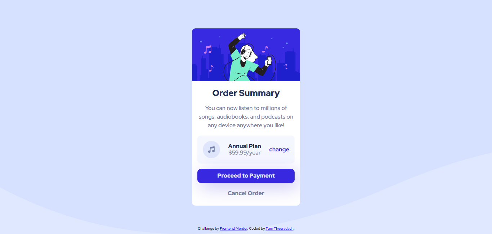

# Frontend Mentor - Order summary card solution

This is a solution to the [Order summary card challenge on Frontend Mentor](https://www.frontendmentor.io/challenges/order-summary-component-QlPmajDUj). Frontend Mentor challenges help you improve your coding skills by building realistic projects. 

## Table of contents

- [Overview](#overview)
  - [The challenge](#the-challenge)
  - [Screenshot](#screenshot)
  - [Links](#links)
- [My process](#my-process)
  - [Built with](#built-with)
  - [What I learned](#what-i-learned)
  - [Continued development](#continued-development)
  - [Useful resources](#useful-resources)
- [Author](#author)
- [Acknowledgments](#acknowledgments)


## Overview

### The challenge

Users should be able to:

- See hover states for interactive elements

### Screenshot



### Links

- Solution URL: [https://github.com/Tam643/Order-summary-component](https://github.com/Tam643/Order-summary-component)
- Live Site URL: [https://main--boisterous-paletas-207f5e.netlify.app/](https://main--boisterous-paletas-207f5e.netlify.app/)

## My process

### Built with

- Semantic HTML5 markup
- Scss 
- Flexbox


### What I learned

```Scss
@mixin fixed-center($width) {
    $transform: calc($width/2);
    transform: translateX(-$transform);
    width: $width;
}

body {
    height: 100vh;
    width: 100vw;
    position: relative;
    background: $Pale_blue url('../../images/pattern-background-desktop.svg') bottom left no-repeat;
    background-size: cover;
}

button.primary{
  box-shadow: 10px 10px 50px hsl(245, 75%, 85%);
}
```


### Continued development

Improving my CSS shadow effects can enhance the visual appeal of my website or application. Here are some advanced techniques and ideas to continue developing my CSS shadow skills:

1. **Custom Shadow Shapes:**
   Experiment with different shadow shapes. Instead of simple box shadows, create custom shapes like circular or triangular shadows. Use the `border-radius` property to round the corners of my shadows.

2. **Multiple Shadows:**
   Apply multiple shadows to an element to create complex shadow effects. I can use the `box-shadow` property multiple times with different offsets and blur radii. This can create layered and more realistic shadows.

```css
box-shadow: 5px 5px 10px #888888, -5px -5px 10px #888888;
```


### Useful resources

**Media Queries in Sass:**

1. [Responsive Design with Sass Breakpoint Mixin](https://www.section.io/engineering-education/facilitating-css-media-queries-using-scss-mixins/): This Section article explains The Best Way to Facilitate CSS Media Queries using SCSS Mixins.

**CSS Background Images:**

1. [CSS Background Image Tutorial](https://www.w3schools.com/css/css3_backgrounds.asp): W3Schools offers a comprehensive tutorial on CSS background images, covering properties like `background-image`, `background-size`, and more.

2. [CSS-Tricks - A Complete Guide to the `background` Property](https://css-tricks.com/almanac/properties/b/background/): This guide on CSS-Tricks provides in-depth information on various background properties, including `background-image`.

## Author

- Frontend Mentor - [@TumTheeradach](https://www.frontendmentor.io/profile/Tam643)
- Twitter - [@TumTheeradach](https://www.twitter.com/TumTheeradach)
